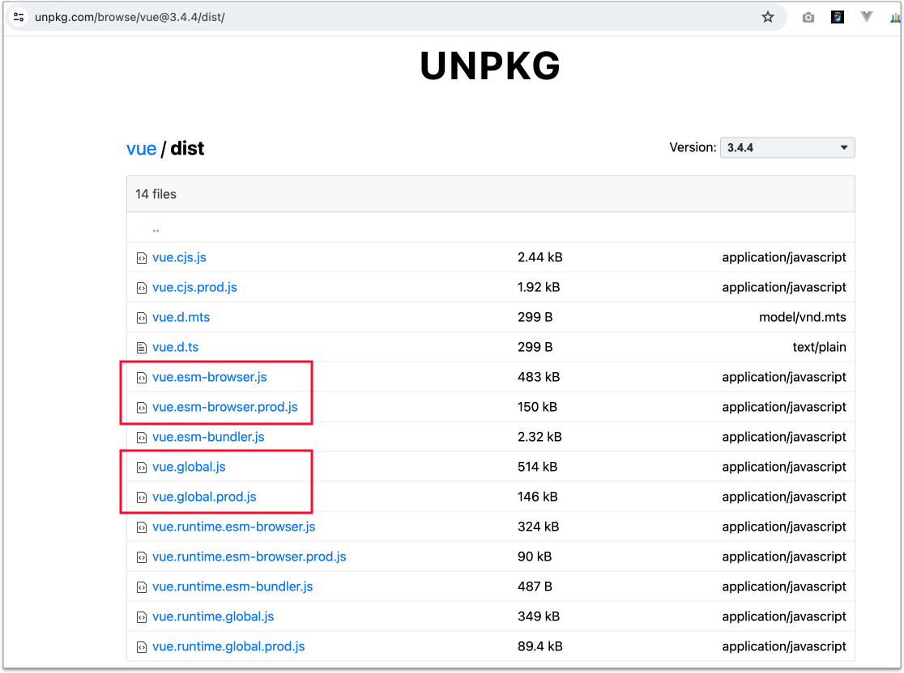

# 3.1 下載安裝

## 1 手動下載 Vue 3 的 JS

到 [UNPKG - vue](https://unpkg.com/browse/vue@3.4.6/) 這個網站，然後確認**右上角的下拉選單**，是最新版本(3.4.6)。

然後進到 **`dist`** 資料夾。將下圖標示的四個檔案，下載到 **`vendors/vue`** 資料夾裡。

<figure><figcaption></figcaption></figure>

## 2 Chrome 瀏覽器安裝 Vue Devtools

使用 Chrome 瀏覽器，進到[此網址](https://chrome.google.com/webstore/detail/vuejs-devtools/nhdogjmejiglipccpnnnanhbledajbpd)來安裝。

## 3 編輯器 安裝 Volar 套件

使用 VS Code 編輯器，安裝「**Vue Language Features (Volar)**」套件，讓編輯器可試別 Vue 相關語法，如下示意圖：

<figure><figcaption></figcaption></figure>

