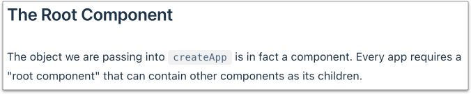
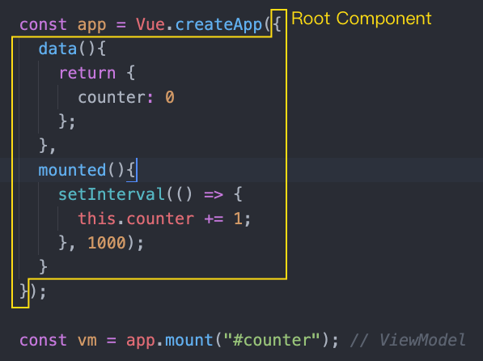

# 4.1 MVVM 模式

## 範例：認識 MVVM 模式

建立 `practice/app_counter.html`，內容如下：


```html
<!DOCTYPE html>
<html lang="zh-Hant">
  <head>
    <meta charset="utf-8">
    <title></title>
  </head>
  <body>
    <div id="counter">
      Counter: {{ counter }}
    </div>

    <button type="button" id="the_btn">按鈕</button>

    <script src="./vendors/vue/vue.global.js"></script>
    <!-- <script src="./vendors/vue/vue.global.prod.js"></script> -->
    <script>

      const app = Vue.createApp({
        data(){
          return {
            counter: 0
          };
        },
        mounted(){
          setInterval(() => {
            this.counter += 1;
          }, 1000);
        }
      });

      const vm = app.mount("#counter"); // ViewModel

      // 元件外的按鈕
      let the_btn_el = document.getElementById("the_btn");
      the_btn_el.addEventListener("click", function(){
        // 分別印出以下資料來觀察：

        //console.log(app);
        //console.log(vm);
        //console.log(vm.$data);

        // 透過 vm 取得元件上的資料，以下兩個寫法都可
        //console.log(vm.$data.counter); // 寫法一
        //console.log(vm.counter);       // 寫法二
      });
    </script>
  </body>
</html>
```


使用本機端網域的方式，開啟 `app_counter.html` 頁面。


先理解程式上的執行順序，再瞭解 MVVM。

MVVM 概念示意圖：

<figure><figcaption><p>MVVM 概念示意</p></figcaption></figure>


另外一個頁面可建立多個。如下範例寫法：

```html
<script>
  
  // 一個 Application Instance
  const app1 = Vue.createApp({
    /* code here ... */
  });
  app1.mount("#counter1");
  
  
  // 另一個 Application Instance
  const app2 = Vue.createApp({
    /* code here ... */
  });
  app2.mount("#counter2");
</script>
```


## 認識 Root Component

官方上有這樣的一段文字：

<figure><figcaption></figcaption></figure>

放到 createApp 函式當中的物件，就是一個元件。示意如下：

<figure><figcaption></figcaption></figure>

Root Component 底下，還可以有很多元件可以掛載使用。示意如下：

<figure><figcaption></figcaption></figure>


