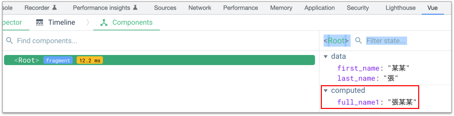

# 4.6 computed 屬性和 watch 屬性

## Computed Properties(計算過的屬性)

跟 methods 的差異，在於 Cache 的機制。


### Options API

**下方的 `full_name1()` 函式一旦觸發，就會產生一個屬性叫做 `full_name1`，對應的資料會是函式的回傳結果，然後就不會再變了，除非 `data` 裡的資料有更動：**


```javascript
computed: {
  full_name1(){
    console.log("full_name1 執行到");
    return this.last_name + this.first_name;
  }
}
```



範例連結：[https://codepen.io/carlos411/pen/poWGQmN](https://codepen.io/carlos411/pen/poWGQmN)



Devtools 的 computed 示意圖：

<figure><figcaption></figcaption></figure>


### Composition API

改成使用 Composition API，使用 **`Vue.computed()`** 函式：




## Watchers(監控資料)

在 **`watch`** 屬性當中，監控 data 當中的某個資料，如下例的 question，留意註解的地方：


```javascript
const RootComponent = {
  data() {
    return {
      question: "Q",
      answer: "A"
    }
  },
  watch: {
    // 監控 question 資料：也就是當 question 資料有改變時，這個函式就會觸發
    question(newQuestion, oldQuestion) {
      console.log("新資料：" + newQuestion); // 這是新的資料
      console.log("原資料：" + oldQuestion); // 這是原來的資料
      if (newQuestion.indexOf('?') > -1) {
        this.getAnswer()
      }
    }
  }
};
```



範例連結：[https://codepen.io/carlos411/pen/PoJVLMM](https://codepen.io/carlos411/pen/PoJVLMM)




## 練習：使用 computed 屬性來計算特價

在 `practice` 資料夾下，建立 **`3computed_attribute.html`** 檔案，貼上以下原始碼(使用單純的 JavaScript)，執行看看：


```html
<!DOCTYPE html>
<html lang="en">
<head>
  <meta charset="UTF-8">
  <meta name="viewport" content="width=device-width, initial-scale=1.0">
  <title>Document</title>
</head>
<body>
  <div id="app">
    <div>原價：<span class="original_price"></span>元</div>
    <div>特價：<span class="on_sale"></span>元</div>
  </div>

  <script>
    let original_price = 300;
    let on_sale = original_price * 0.8;

    let original_price_el = document.getElementsByClassName("original_price")[0];
    let on_sale_el = document.getElementsByClassName("on_sale")[0];

    original_price_el.innerHTML = original_price;
    on_sale_el.innerHTML = on_sale;
  </script>
</body>
</html>
```



在 `practice` 資料夾下，建立 **`3computed_attribute_vue.html`** 檔案，將以上的原始碼，改成使用 vue 的語法。**請建立一個 computed properties 叫做 onSale**。

