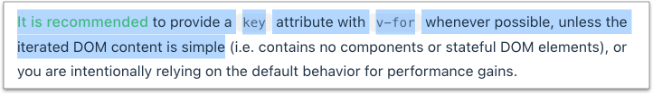

# 4.9 指令 directive - 迴圈

## v-for

<figure><figcaption></figcaption></figure>


在迴圈當中，建議都直接加上 **`key`** 屬性，然後給定唯一值。



### 範例 1：使用 v-for 來跑陣列資料

例：


```html
<ul id="my_app">
  <li v-for="item in items" :key="item.id">
    {{ item.book_name }}：{{ item.book_price }} 元
  </li>
</ul>
```



```javascript
const RootComponent = {
  data(){
    return {
      items: [
        {
          id: "abc",
          book_name: "書名一",
          book_price: 299
        },
        {
          id: "def",
          book_name: "書名二",
          book_price: 399
        }
      ]
    };
  }
};
```



範例網址：[https://codepen.io/carlos411/pen/eYGqNre](https://codepen.io/carlos411/pen/eYGqNre)




### 範例 2：使用 v-for 取得陣列索引值

使用 `(item, index)`；

另外也可以取得其它 data 資料，例如下方的 `other_msg`。

例：


```html
<ul id="my_app">
  <li v-for="(item, index) in items" :key="item.id">
    {{ other_msg }}
    <br>
    {{ index }} - {{ item.book_name }}：{{ item.book_price }} 元
  </li>
</ul>
```



```javascript
const MyAppSetting = {
  data(){
    return {
      other_msg: "其它訊息",
      items: [
        {
          id: "abc",
          book_name: "書名一",
          book_price: 299
        },
        {
          id: "def",
          book_name: "書名二",
          book_price: 399
        }
      ]
    };
  }
};
```



範例網址：[https://codepen.io/carlos411/pen/vYeoOzq](https://codepen.io/carlos411/pen/vYeoOzq)




`item in items` 也可以改成 **`item of items`**。

`(item, index) in items` 也可以改成 **`(item, index) of items`**。



### 範例 3：使用 v-for 來跑物件資料

例：


```html
<ul id="my_app">
  <li v-for="value in book" :key="value">
    {{ value }}
  </li>
</ul>
```



```javascript
const MyAppSetting = {
  data(){
    return {
      book: {
        name: "書名一",
        price: 299,
        author: "作者一"
      }
    };
  }
};
```



範例網址：[https://codepen.io/carlos411/pen/mdBNweJ](https://codepen.io/carlos411/pen/mdBNweJ)




### 範例 4：使用 v-for 取得物件的 key 以及迴圈當中的索引值

例：


```html
<ul id="my_app">
  <li v-for="(value, key, index) in book" :key="index">
    {{ index }} - {{ key }}：{{ value }}
  </li>
</ul>
```



```javascript
const MyAppSetting = {
  data(){
    return {
      book: {
        name: "書名一",
        price: 299,
        author: "作者一"
      }
    };
  }
};
```



範例網址：[https://codepen.io/carlos411/pen/RwLXgRP](https://codepen.io/carlos411/pen/RwLXgRP)




### 範例 5：v-for 直接跑數值

下例的 **`n`**，會自動從 1 開始。例：


```html
<div id="my_app">
  <span v-for="n in 10" :key="n">{{ n }}</span>
</div>
```



```javascript
const MyAppSetting = {
  data() {
    return {};
  }
};
```



範例網址：[https://codepen.io/carlos411/pen/YzrmvZJ](https://codepen.io/carlos411/pen/YzrmvZJ)




### 範例 6：使用 v-for 搭配 template 標籤

例：


```html
<ul id="my_app">
  <template v-for="(item, index) in items" :key="item.id">
    <li>{{ item.name }} - {{ item.price }} 元</li>
    <li class="divider"></li>
  </template>
</ul>
```



```javascript
const MyAppSetting = {
  data(){
    return {
      items: [
        {
          id: "a",
          name: "書名一",
          price: 299
        },
        {
          id: "b",
          name: "書名二",
          price: 399
        }
      ]
    };
  }
};
```



範例網址：[https://codepen.io/carlos411/pen/LYzwrjr](https://codepen.io/carlos411/pen/LYzwrjr)




## v-for 和 v-if 同時使用

留意 `v-for` 和 `v-if` 若使用在同一個元素上， `v-if` 會有較高的執行優先權，也就是會先執行 `v-if`。


例，以下程式是錯的，因為 v-if 當中的 `todo` 是不存在的，無法取用到 v-for 當中的 `todo`。


```html
<li v-for="todo in todos" v-if="todo.isComplete">
  {{ todo.name }}
</li>
```


可以改成：


```html
<template v-for="todo in todos" :key="todo.name">
  <li v-if="todo.isComplete">
    {{ todo.name }}
  </li>
</template>
```



## 練習：跑迴圈渲染出 FAQ 以及加 class

在 `practice` 資料夾下，建立 **`5loop.html`** 檔案，貼上以下原始碼(使用單純的 JavaScript)，執行看看：


```html
<!DOCTYPE html>
<html lang="en">
<head>
  <meta charset="UTF-8">
  <meta name="viewport" content="width=device-width, initial-scale=1.0">
  <title>Document</title>
  <style>
    ul.qa_list > li{
      margin-bottom: 20px;
    }
    ul.qa_list > li div.q{
      border-bottom: 1px solid #ccc;
      margin-bottom: 5px;
    }
    ul.qa_list > li:last-child{
      margin-bottom: 0;
    }

    .important{
      font-weight: bold;
      color: red;
    }
  </style>
</head>
<body>
  <div id="app">
    <ul class="qa_list"></ul>
  </div>

  <script>
    let arr_data = [
      {
        q: "如何加入會員呢？",
        a: "臨櫃辦理。",
        is_important: false
      },
      {
        q: "該如何繳費呢？",
        a: "持條碼至超商繳費。",
        is_important: true
      },
      {
        q: "週末門市有開嗎？",
        a: "沒有，放假。",
        is_important: false
      }
    ];

    arr_data.forEach(function(item, index){
      let li_str = `
        <li class="${item.is_important ? "important" : "" }">
          <div class="q">Q${index+1}: ${item.q}</div>
          <div class="a">A: ${item.a}</div>
        </li>
      `;
      let ul_el = document.getElementsByClassName("qa_list")[0];
      ul_el.insertAdjacentHTML("beforeend", li_str);
    });
  </script>
</body>
</html>
```



在 `practice` 資料夾下，建立 **`5loop_vue.html`** 檔案，將以上的原始碼，改成使用 vue 的語法。

