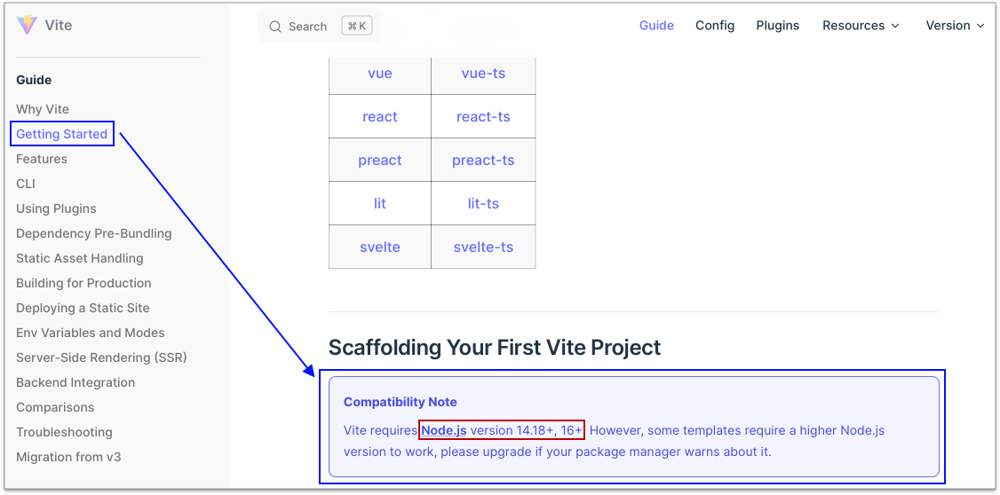
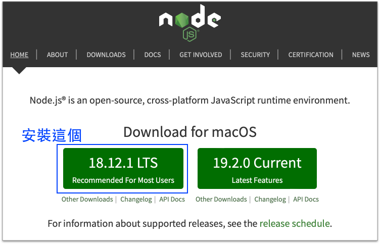
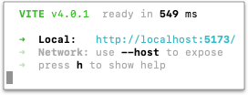

# 8 認識單頁應用程式(SPA)

SPA: Single Page Application

在專案開始前，就需要先決定是否要導入此架構，而不是網站做到一半才導入。做 SPA 主要需要三個工具：

* [Vite](https://vitejs.dev/)
* [Vue](https://vuejs.org/)
* [Vue Router](https://router.vuejs.org/)


註：安裝 Vite 之前，官方有[以下的敘述](https://vitejs.dev/guide/#scaffolding-your-first-vite-project)：

<figure><figcaption></figcaption></figure>

也就是需先安裝 [Node.js](https://nodejs.org/en/) 14.18 以上的版本。可執行以下指令(**`node -v`**)查看 Node.js 目前您電腦所使用的版本(以下的 **`$`** 代表是指令的意思，所以請勿輸入錢字號)：

```bash
$ node -v
v18.12.1
```

若 Node.js 未安裝，如下圖下載安裝：

<figure><figcaption></figcaption></figure>


## 第 1 步：安裝 Vite

假設在電腦桌面建立 vite 資料夾，就在 vite 資料夾下，執行以下指令：

```bash
npm create vite@latest
```


```
Project name: spa-app
Select a framework: Vue
Select a variant: JavaScript
```

再執行以下指令：

```
cd spa-app
npm install
npm run dev
```

看到如下圖：

<figure><figcaption></figcaption></figure>


## 第 2 步：認識資料夾及 build 和 preview

打包產生 **`dist`** 資料夾：

```bash
npm run build
```

瀏覽 **`dist`** 資料夾：

```
npm run preview
```


## 第 3 步：安裝 Vue Router

```bash
npm install vue-router@4
```


## 第 4 步：設定指向到 src 資料夾

更新 **`vite.config.js`** 檔案。

設定別名 **`@`** 指向到 **`src`** 資料夾：

新增第3行及第8行的 resolve：


```javascript
import { defineConfig } from 'vite'
import vue from '@vitejs/plugin-vue'
import path from 'path'

// https://vitejs.dev/config/
export default defineConfig({
  plugins: [vue()],
  resolve: {
    alias: {
      "@": path.resolve(__dirname, "./src")
    }
  }
})

```



## 第 5 步：認識 vue 檔

將 **`style.css`** 檔的內容全部移除。

將 **`App.vue`** 檔，更新成如下：


```javascript
<script>
</script>

<template>
</template>

<style scoped>
</style>
```


將 components 資料夾裡的 **`HelloWorld.vue`** 檔案移除。


## 第 6 步：建立首頁

建立首頁會用到的 **`src/views/Home.vue`** 元件檔。

以及 **`src/router/index.js`** 路由檔，及其它更新。

內容如下：



<pre class="language-javascript" data-line-numbers><code class="lang-javascript">import { createRouter, createWebHistory } from "vue-router";

const routes = [
  // 網址定義：/；給定名稱 Home；載入 Home.vue 元件
  {path: '/', name: 'Home', component: () => import('@/views/Home.vue')}
];

<strong>const router = createRouter({
</strong>  history: createWebHistory(),
  routes
});

export default router;
</code></pre>




```javascript
<script>
  export default {
    data(){
      return {
        msg: "Home"
      };
    }
  }
</script>

<template>
  <div class="block">
    這是：{{ msg }}
  </div>
</template>

<style scoped>
</style>
```





```javascript
import { createApp } from 'vue'
//import './style.css'
import App from './App.vue'
import router from '@/router/index.js'

createApp(App).use(router).mount('#app');
```





```javascript
<script>
  export default {
    data(){
      return {};
    }
  }
</script>

<template>
  <router-view v-slot="{Component}">
    <component :is="Component" :key="$route.path"></component>
  </router-view>
</template>

<style scoped>
</style>
```





## 第 7 步：建立第二個頁面

更新以下程式：



在 routes 陣列當中，多加一個：


```javascript
{path: '/destination/:id', name: 'destination', component: () => import('@/views/Destination.vue')}
```





```javascript
<script>
  export default {
    data(){
      return {
        name: "臺北"
      };
    }
  }
</script>

<template>
  <div class="block">
    目的地：{{ name }}
  </div>
</template>

<style scoped>
</style>
```





## 第 8 步：加上導覽列

更新 **`src/App.vue`**，在 template 標籤當中，加以下的原始碼：


```html
<header>
  <a href="/">首頁</a> |
  <a href="/destination/1">臺北</a> |
  <a href="/destination/2">桃園</a>
</header>
```


然後測一下(觀察開發者工具的 network)，測完之後，改成用以下：


```html
<header>
  <router-link to="/">首頁</router-link> |
  <router-link to="/destination/1">臺北</router-link> |
  <router-link to="/destination/2">桃園</router-link>
</header>
```



## 第 9 步：加上資料

加上 **`src/data.json`**，內容如下：


```json
{
  "destinations": [
    {
      "name": "臺北",
      "id": 1,
      "description":"臺北景點描述"
    },
    {
      "name": "桃園",
      "id": 2,
      "description":"桃園景點描述"
    }
  ]
}
```



## 第 10 步：加上迴圈跑導覽列

更新 **`src/App.vue`**，script 標籤的部份，內容如下：


```javascript
<script>
  import sourceData from "@/data.json";

  export default {
    data(){
      return {
        destinations: sourceData.destinations
      };
    }
  }
</script>
```



header 標籤的部份，改成如下：


```html
<header>
  <router-link to="/">首頁</router-link> |
  <router-link v-for="destination in destinations" :key="destination.id" :to="'/destination/'+destination.id">
    {{ destination.name }}
  </router-link>
  <!-- <router-link to="/destination/1">臺北</router-link> | -->
  <!-- <router-link to="/destination/2">桃園</router-link> -->
</header>
```



## 第 11 步：景點頁面修改

修改 **`views/Destination.vue`** 頁面：


```javascript
<script>
  import sourceData from "@/data.json";

  export default {
    data(){
      return {
        //name: "臺北"
      };
    },
    computed: {
      // destination(){
      //   var d = sourceData.destinations.find((destination) => {
      //     return destination.id == parseInt(this.$route.params.id)
      //   });
      //   return d;
      // },
      destination(){
        return sourceData.destinations.find(destination => destination.id == parseInt(this.$route.params.id));
      }
    }
  }
</script>

<template>
  <div class="block">
    目的地：{{ destination.name }}
    <br>
    {{ destination.description }}

  </div>
</template>

<style scoped>
</style>
```



## 第 12 步：建立導覽列元件

建立 **`src/components/TheNavigation.vue`** 檔案，內容如下：


```javascript
<script>
  import sourceData from "@/data.json";
  export default {
    data(){
      return {
        destinations: sourceData.destinations
      };
    }
  }
</script>

<template>
  <router-link v-for="destination in destinations" :key="destination.id" :to="'/destination/'+destination.id">
    {{ destination.name }}
  </router-link>
</template>

<style scoped>
</style>
```



更新 **`src/App.vue`**，內容如下：


```javascript
<script>
  //import sourceData from "@/data.json";
  import TheNavigation from "@/components/TheNavigation.vue";

  export default {
    components: {TheNavigation},
    data(){
      return {
        //destinations: sourceData.destinations
      };
    }
  }
</script>

<template>
  <header>
    <router-link to="/">首頁</router-link> |
    
    <TheNavigation></TheNavigation>
    
    <!-- <router-link v-for="destination in destinations" :key="destination.id" :to="'/destination/'+destination.id">
      {{ destination.name }}
    </router-link> -->
    <!-- <router-link to="/destination/1">臺北</router-link> | -->
    <!-- <router-link to="/destination/2">桃園</router-link> -->
  </header>

  <router-view v-slot="{Component}">
    <component :is="Component" :key="$route.path"></component>
  </router-view>
</template>

<style scoped>
</style>
```



## 第 13 步：載入外部 CSS

建立 **`public/main.css`** 檔案：


```css
* {
  box-sizing: border-box;
}
body{
  margin: 0;
}
#app header{
  background-color: #2c3e50;
}

#app header a{
  color: white;
  display: inline-block;
  margin-right: 20px;
}

#app div.block{
  background-color: #ddd;
  min-height: calc(100vh - 24px);
}
```


在 **`index.html`** 檔的 head 結束標籤之前，放以下原始碼：


```html
<link rel="stylesheet" href="/main.css">
```



## 第 14 步：build and preview

產生 dist 資料夾：

```
npm run build
```

瀏覽 dist 資料夾：

```
npm run preview
```

如果未來要上線，要上線的會是 **`dist`** 資料夾。


## 第 15 步：建立另一個網頁檔

在 **`spa-app`** 資料夾下，建立 **`index2.html`**，內容如下：


```html
<!DOCTYPE html>
<html lang="zh-Hant">
  <head>
    <meta charset="utf-8">
    <title></title>
  </head>
  <body>
    <h1>另一個頁面</h1>
  </body>
</html>
```


更新 **`vite.config.js`**，內容如下(多 **`build`** 那個部份)：


```javascript
import { defineConfig } from 'vite'
import vue from '@vitejs/plugin-vue'
import path from 'path'

// https://vitejs.dev/config/
export default defineConfig({
  plugins: [vue()],
  resolve: {
    alias: {
      "@": path.resolve(__dirname, "./src")
    }
  },
  build: {
    rollupOptions: {
      input: {
        main: path.resolve(__dirname, 'index.html'),
        other: path.resolve(__dirname, 'index2.html')
      }
    }
  }
})
```


若需要 build 的話，就再執行：

```
npm run build
npm run preview
```


## 完成的範例

[https://alldata.sgp1.digitaloceanspaces.com/sample/spa-app.zip](https://alldata.sgp1.digitaloceanspaces.com/sample/spa-app.zip)

需記得在 **`spa-app`** 資料夾下，執行以下指令來安裝相關套件(即產生 `node_modules` 資料夾)：

```bash
npm install
```


## 參考資料

免費線上課程：[https://vueschool.io/courses/vue-router-4-for-everyone](https://vueschool.io/courses/vue-router-4-for-everyone)


