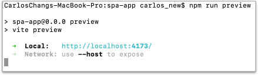
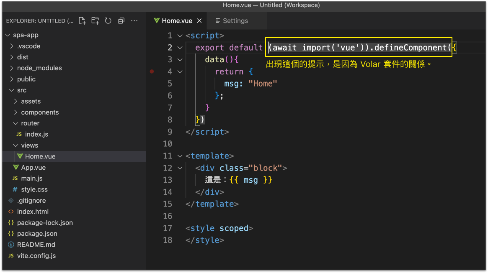
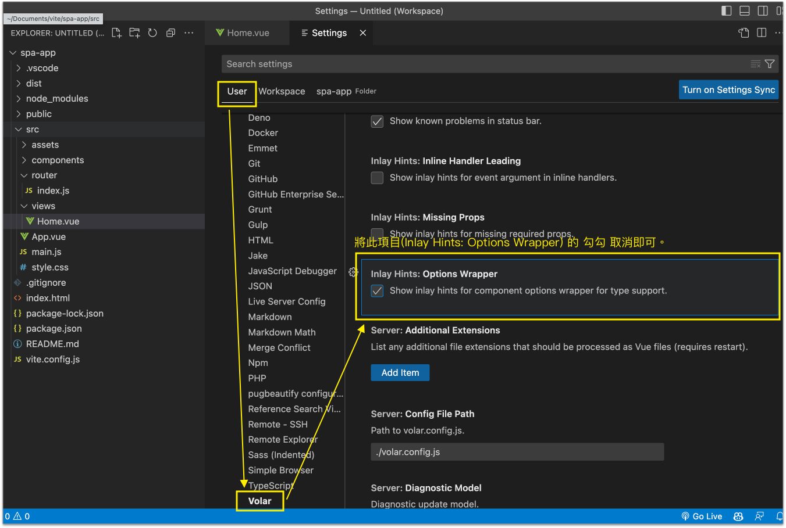

# 8 認識單頁應用程式(SPA)

SPA: Single Page Application

在專案開始前，就需要先決定是否要導入此架構，而不是網站做到一半才導入。做 SPA 主要需要三個工具：

* [Vite](https://vitejs.dev/)
* [Vue](https://vuejs.org/)
* [Vue Router](https://router.vuejs.org/)


註：安裝 Vite 之前，官方有[以下的敘述](https://vitejs.dev/guide/#scaffolding-your-first-vite-project)：

<figure><figcaption></figcaption></figure>

也就是需先安裝 [Node.js](https://nodejs.org/en/) 14.18 以上的版本。可執行以下指令(**`node -v`**)查看 Node.js 目前您電腦所使用的版本(以下的 **`$`** 代表是指令的意思，所以請勿輸入錢字號)：

```bash
$ node -v
v18.12.1
```

若 Node.js 未安裝，如下圖下載安裝：

<figure><figcaption></figcaption></figure>


## 第 1 步：安裝 Vite

假設在電腦桌面建立 vite 資料夾，就在 vite 資料夾下，執行以下指令：

```bash
npm create vite@latest
```


```
Project name: spa-app
Select a framework: Vue
Select a variant: JavaScript
```

再執行以下指令：

```
cd spa-app
npm install
npm run dev
```

看到如下圖：

<figure><figcaption></figcaption></figure>


將 **`components/HelloWorld.vue`** 檔的 script 標籤都註解起來，改成以下：


```html
<!--
<script setup>
import { ref } from 'vue'

defineProps({
  msg: String,
})

const count = ref(0)
</script>
-->
<script>
export default {
  props: ["msg"],
  data(){
    return {
      count: 0
    }
  }
}
</script>
```



## 第 2 步：認識資料夾及 build 和 preview

打包產生 **`dist`** 資料夾(如果最後要上線，要上線的是 dist 資料夾裡的東西)：

```bash
npm run build
```


瀏覽 **`dist`** 資料夾：

```
npm run preview
```

出現如下圖：

<figure><figcaption></figcaption></figure>


## 第 3 步：安裝 Vue Router

```bash
npm install vue-router@4
```

此時，在 **`package.json`** 檔，會多了以下 **`vue-router`** 的部份：


```javascript
"dependencies": {
    ...
    "vue-router": "^4.1.6"
    
  },
```



## 第 4 步：設定 `@` 指向到 src 資料夾

更新 **`vite.config.js`** 檔案。

設定別名 **`@`** 指向到 **`src`** 資料夾：

新增第3行及第8行的 resolve：


```javascript
import { defineConfig } from 'vite'
import vue from '@vitejs/plugin-vue'
import path from 'path'

// https://vitejs.dev/config/
export default defineConfig({
  plugins: [vue()],
  resolve: {
    alias: {
      "@": path.resolve(__dirname, "./src")
    }
  }
})
```


關於 `vite.config.js` 的相關設定，可參考官方：[https://vitejs.dev/config/](https://vitejs.dev/config/)

針對 `resolve.alias` 的部份，可參考：[https://vitejs.dev/config/shared-options.html#resolve-alias](https://vitejs.dev/config/shared-options.html#resolve-alias)


## 第 5 步：放圖檔

建立 `src/assets/images/` 資料夾，放入以下三張圖檔(直接下載)：

[https://alldata.sgp1.digitaloceanspaces.com/images/vue\_images.zip](https://alldata.sgp1.digitaloceanspaces.com/images/vue\_images.zip)


## 第 6 步：認識 vue 檔

將 **`style.css`** 檔的內容全部移除，改成如下：


```css
* {
  box-sizing: border-box;
}
body{
  margin: 0;
}
/* 設定圖片最大寬度為 100% */
img {
  max-width: 100%;
}

footer.footer {
  text-align: center;
  font-size: 0.8rem;
  color: #999;
  margin-top: 1rem;
  padding-top: 1rem;
  border-top: 1px solid #ccc;
}
```


將 **`App.vue`** 檔，更新成如下：


```html
<script>
</script>

<template>
</template>

<!-- 這裡的 scoped 屬性，是讓所寫的 CSS，「只」會套用到此元件的 template。 -->
<style scoped>
</style>
```


將 components 資料夾裡的 **`HelloWorld.vue`** 檔案移除。(若想保留當參考，可不用移除。)


## 第 7 步：建立導覽列元件

建立 `src/components/` 資料夾，裡面建立 `TheNavigation.vue` 檔案，內容如下：


```javascript
<script>
</script>

<template>
  <nav class="nav">
    <router-link to="/">介紹頁</router-link> |
    <router-link to="/product_list">商品列表頁</router-link>
  </nav>
</template>

<style scoped>
  /* 將導覽列 nav 用漂亮一些，我要典雅的風格，而且要置中 */
  nav.nav {
    text-align: center;
    font-size: 1.2rem;
    color: #999;
    margin: 10px 0;
  }
  /* 導覽列的 a 標籤，好看一些，且有 router-link-exact-active 的 class，外觀應不一樣 */
  nav.nav a {
    color: #999;
    display: inline-block;
    /* 當有 router-link-exact-active 這個 class 時，顏色改變 */
    text-decoration: none;

    padding: 0.2rem 0.5rem;
  }
  nav.nav a:hover {
    color: #333;
  }
  nav.nav .router-link-exact-active {
    color: #333;
  }
  /* 滑鼠移過，以及 router-link-exact-active 這個 class 對應的 a 標籤，都設定背景色及圓角 */
  nav.nav a:hover, nav.nav .router-link-exact-active {
    background-color: #eee;
    border-radius: 0.5rem;
  }
</style>
```



## 第 8 步：建立首頁(Intro)

* 建立 **`src/views/`** 資料夾：「`每個頁面(view)`」都會對應到一個「`vue 元件檔`」。
* 建立 **`src/router/`** 資料夾：用來管理`網址(路由)`。


建立首頁會用到的 **`src/views/Intro.vue`** 元件檔。

以及 **`src/router/index.js`** 路由檔。

然後更新以下原始碼，如下：



<pre class="language-javascript" data-line-numbers><code class="lang-javascript">import { createRouter, createWebHistory } from "vue-router";

const routes = [
  // 網址定義：/；給定名稱 Intro；載入 Intro.vue 元件
  {path: '/', name: 'Home', component: () => import('@/views/Intro.vue')}
];

<strong>const router = createRouter({
</strong>  history: createWebHistory(),
  routes
});

export default router;
</code></pre>




```javascript
<script>
  export default {
    data(){
      return {
      };
    }
  }
</script>

<template>
  <div class="intro">
      
    <div class="intro__item">
      <div class="intro__item__img">
        
      </div>
      <div class="intro__item__text">
        <h2 class="title2">Kindle</h2>
        <p class="para">
          Kindle 是一款電子書閱讀器，由美國亞馬遜公司開發，於2007年11月19日推出。Kindle的名字來自於亞馬遜公司的網站名稱，亞馬遜公司的網站名稱是以亞馬遜河的名字命名的，而亞馬遜河的名字來自於一個古希臘語的詞，意思是「沒有尾巴的河」，而Kindle的名字也是以此為由。
        </p>
      </div>
    </div>

    <div class="intro__item">
      <div class="intro__item__text">
        <h2 class="title2">風景</h2>
        
        <p class="para">
          綠色的海邊，橘黃色的沙灘，藍色的海，藍色的天空，白色的雲，這些都是海邊的風景。海邊的風景很漂亮，我們可以在海邊玩耍，也可以在海邊看日出日落。
        </p>

      </div>
      <div class="intro__item__img">
        
      </div>
    </div>

    <div class="intro__item">
      <div class="intro__item__img">
        
      </div>
      <div class="intro__item__text">
        <h2 class="title2">第三個區塊</h2>
        <p class="para">
          貓咪是一種可愛的動物，我們可以養貓，也可以養狗。貓咪的毛很柔軟，我們可以摸摸它的毛，也可以摸摸它的肚子。
        </p>
      </div>
    </div>

  </div>      
</template>

<style scoped>
  div.intro__item {
    display: flex;
    flex-direction: row;
    align-items: center;
    justify-content: center;
    width: 100%;
    margin: 1rem 0;
    border: 1px solid #ccc;
  }
  div.intro__item > div {
    width: 50%;
    padding: 0;
  }
  div.intro__item__img {
    align-self: flex-start;
  }
  div.intro__item__img > img {
    width: 100%;
  }

  div.intro__item > div.intro__item__img > img {
    vertical-align: bottom;
  }
  div.intro__item__img:nth-child(odd) {
    margin-right: 1rem;
  }
  div.intro__item__img:nth-child(even) {
    margin-left: 1rem;
  }
  h2.title2 {
    font-size: 1.2rem;
    color: #333;
    margin: 0.5rem .5rem;
  }
  p.para {
    font-size: 0.9rem;
    color: #666;
    margin: 0.5rem 0.5rem;
  }

  @media (max-width: 575.98px) {
    div.intro__item {
      flex-direction: column;
    }
    div.intro__item__img {
      order: 1;
      width: 100% !important;
      margin: 0 !important;
      padding: 0;
    }
    div.intro__item__img > img {
      width: 100%;
    }
    div.intro__item__text {
      order: 2;
      width: 100% !important;
    }
    div.intro__item__text > h2, div.intro__item__text > p {
      padding: 0 1rem;
      margin-left: 0;
      margin-right: 0;
    }
  }
</style>
```





```javascript
import { createApp } from 'vue'
import './style.css'
import App from './App.vue'
import router from '@/router/index.js'

createApp(App).use(router).mount('#app');
```





```javascript
<script>
  import TheNavigation from "@/components/TheNavigation.vue";

  export default {
    components: {TheNavigation},
    data(){
      return {};
    }
  }
</script>

<template>
  
  <TheNavigation></TheNavigation>

  <!-- 使用 router-view 來呈現頁面網址對應的元件 -->
  <router-view v-slot="{Component}">
    <component :is="Component" :key="$route.path"></component>
  </router-view>

  <footer class="footer">
    <audio controls loop>
      <source src="https://alldata.sgp1.digitaloceanspaces.com/audio/happy-lazy.mp3" type="audio/mpeg">
    </audio>
    <div>
      Music by <a href="https://pixabay.com/users/sergequadrado-24990007/?utm_source=link-attribution&amp;utm_medium=referral&amp;utm_campaign=music&amp;utm_content=109007">SergeQuadrado</a> from <a href="https://pixabay.com//?utm_source=link-attribution&amp;utm_medium=referral&amp;utm_campaign=music&amp;utm_content=109007">Pixabay</a>
    </div>
  </footer>
</template>

<!-- 這裡的 scoped 屬性，是讓所寫的 CSS，「只」會套用到此元件的 template。 -->
<style scoped>
</style>
```





在編輯 `Intro.vue` 時，若出現以下的訊息：

<figure><figcaption></figcaption></figure>

可透過下圖來關掉提示(先進到編輯器的偏好設定)：

<figure><figcaption></figcaption></figure>


## 第 9 步：建立第二個頁面(ProductList)

更新以下程式：



在 routes 陣列當中，多加一個：


```javascript
{path: '/product_list', name: 'ProductList', component: () => import('@/views/ProductList.vue')},
```





```javascript
<script>
  export default {
    data() {
      return {
        products: [
          {
            "p_name": "商品名稱1商品名稱1商品名稱1商品名稱1商品名稱1商品名稱1商品名稱1商品名稱1商品名稱1商品名稱1商品名稱1商品名稱1商品名稱1商品名稱1",
            "p_img": "https://picsum.photos/id/110/400/300"
          },
          {
            "p_name": "商品名稱2商品名稱2商品名稱2商品名稱2商品名稱2商品名稱2商品名稱2",
            "p_img": "https://picsum.photos/id/111/400/300"
          },
          {
            "p_name": "商品名稱3",
            "p_img": "https://picsum.photos/id/112/400/300"
          },
          {
            "p_name": "商品名稱4",
            "p_img": "https://picsum.photos/id/113/400/300"
          },
          {
            "p_name": "商品名稱5",
            "p_img": "https://picsum.photos/id/114/400/300"
          },
          {
            "p_name": "商品名稱6",
            "p_img": "https://picsum.photos/id/115/400/300"
          },
          {
            "p_name": "商品名稱7",
            "p_img": "https://picsum.photos/id/116/400/300"
          },
          {
            "p_name": "商品名稱8",
            "p_img": "https://picsum.photos/id/117/400/300"
          },
          {
            "p_name": "商品名稱9",
            "p_img": "https://picsum.photos/id/118/400/300"
          },
          {
            "p_name": "商品名稱10",
            "p_img": "https://picsum.photos/id/119/400/300"
          },
          {
            "p_name": "商品名稱11",
            "p_img": "https://picsum.photos/id/120/400/300"
          },
          {
            "p_name": "商品名稱12",
            "p_img": "https://picsum.photos/id/121/400/300"
          },
          {
            "p_name": "商品名稱13",
            "p_img": "https://picsum.photos/id/122/400/300"
          },
          {
            "p_name": "商品名稱14",
            "p_img": "https://picsum.photos/id/123/400/300"
          },
          {
            "p_name": "商品名稱15",
            "p_img": "https://picsum.photos/id/124/400/300"
          },
          {
            "p_name": "商品名稱16",
            "p_img": "https://picsum.photos/id/125/400/300"
          },
          {
            "p_name": "商品名稱17",
            "p_img": "https://picsum.photos/id/126/400/300"
          },
          {
            "p_name": "商品名稱18",
            "p_img": "https://picsum.photos/id/127/400/300"
          }
        ]
      }
    }
  }
</script>

<template>
  <div class="img_block">
  </div>

  <ul class="p_list">
    <li v-for="product in products" :key="product.p_name">
      <h1>{{ product.p_name }}</h1>
      
    </li>
  </ul>
</template>

<style scoped>
  div.img_block {
    background-image: url("https://picsum.photos/id/128/1200/800");
    background-size: cover;
    background-position: center;
    background-repeat: no-repeat;
    height: 300px;
    position: sticky;
    top: 0;
    z-index: -1; /* 下方的區域，手機版時，才能蓋住 */
  }

  ul.p_list {
    display: flex;
    flex-wrap: wrap;
    border: 1px solid #ccc;
    margin: 20px 0 0 0;
    padding: 10px;
    list-style: none;
    z-index: 99;
    position: relative;
    background-color: white;
  }
  ul.p_list > li {
    width: calc((100% - 60px) / 4);
    border: 1px solid #ccc;
    margin-right: 20px;
    margin-bottom: 20px;
  }
  ul.p_list > li:nth-child(4n) {
    margin-right: 0;
  }
  ul.p_list > li > img {
    vertical-align: bottom;
    width: 100%;
  }
  ul.p_list > li > h1 {
    font-size: 1rem;
    color: #333;
    height: 45px;
    margin: 0.5rem .5rem;
    display: -webkit-box;
    -webkit-line-clamp: 2;
    -webkit-box-orient: vertical;
    overflow: hidden;
    text-overflow: ellipsis;
  }

  @media (max-width: 575.98px) {
    ul.p_list > li {
      width: calc((100% - 20px) / 2);
      border: 1px solid #ccc;
      margin-right: 20px;
      margin-bottom: 20px;
    }
    ul.p_list > li:nth-child(2n) {
      margin-right: 0;
    }
  }
</style>
```





## 第 10 步：build and preview

產生 dist 資料夾：

```
npm run build
```

瀏覽 dist 資料夾：

```
npm run preview
```

如果未來要上線，要上線的會是 **`dist`** 資料夾。


## 第 11 步：建立另一個網頁檔

在 **`spa-app`** 資料夾下，建立 **`index2.html`**，內容如下：


```html
<!DOCTYPE html>
<html lang="zh-Hant">
  <head>
    <meta charset="utf-8">
    <title></title>
  </head>
  <body>
    <h1>另一個頁面</h1>
  </body>
</html>
```


如果使用 **`npm run build`** 指令的話，是不會有 `index2.html` 檔案的，要再加以下的設定才會有。


更新 **`vite.config.js`**，內容如下(多 **`build`** 那個部份)：


```javascript
import { defineConfig } from 'vite'
import vue from '@vitejs/plugin-vue'
import path from 'path'

// https://vitejs.dev/config/
export default defineConfig({
  plugins: [vue()],
  resolve: {
    alias: {
      "@": path.resolve(__dirname, "./src")
    }
  },
  build: {
    rollupOptions: {
      input: {
        main: path.resolve(__dirname, 'index.html'),
        other: path.resolve(__dirname, 'index2.html')
      }
    }
  }
})
```


若需要 build 的話，就再執行：

```
npm run build
npm run preview
```


## 完成的範例

上述步驟完成後的原始碼：

[https://alldata.sgp1.digitaloceanspaces.com/sample/spa-app.zip](https://alldata.sgp1.digitaloceanspaces.com/sample/spa-app.zip)


需在 **`spa-app`** 資料夾下，執行以下指令來安裝相關套件(即產生 `node_modules` 資料夾)：

```bash
npm install
```


